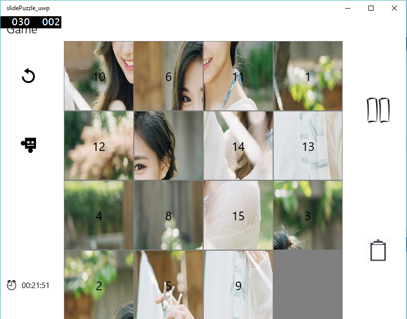

# Slide Puzzle
> It serves `slide puzzle game` on tablet device.

### Used Technologies

UWP, Visual Studio, Tablet  

## Description

The main algorithm for this game is to implement to logical blocks on screen.(seperated by pixels) The blocks move is restricted by pixel calulatioin. Each block can contain text(Block number) and picture. Intro animation is made by moving blocks. The pictures for the game can be selected in your computer or can be taken by camera. You can select picture with number or only number or only the picture. It also serves accelerometer to move blocks on your tablet. You can select auto-ordered button if you can't find the right puzzle.

## Screen Shot




## Installation

Windows:

```sh

```

## Usage example

## Development setup